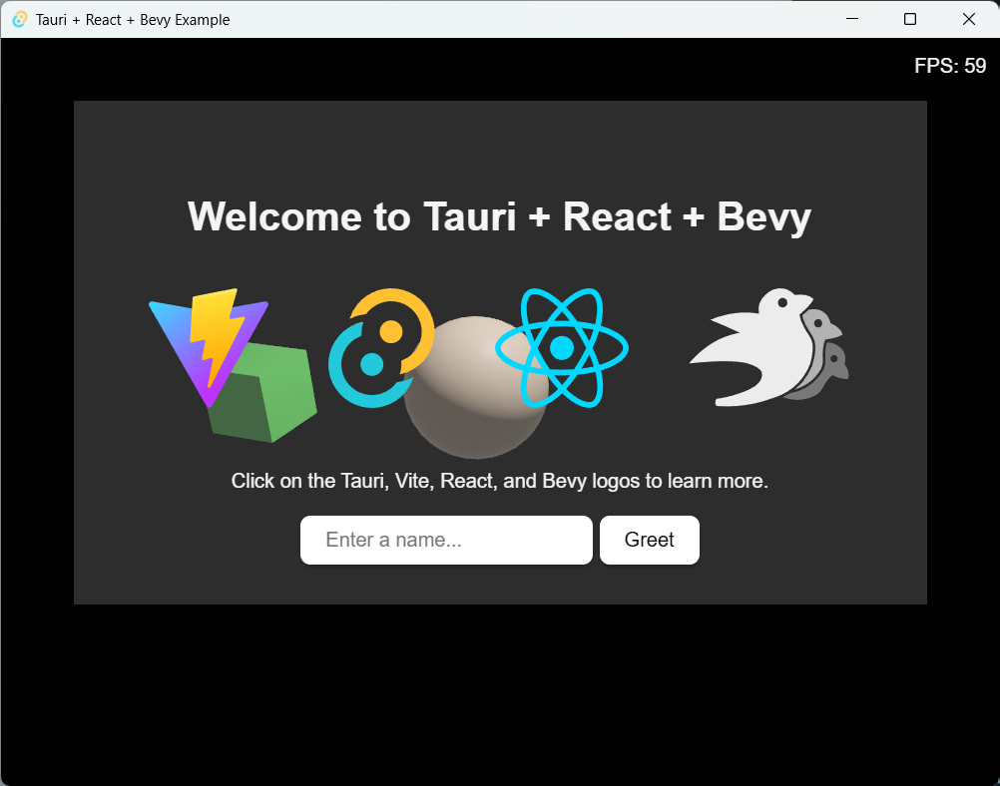

# Bevy + Tauri Example

This is an example of how to use Tauri as the window manager for a Bevy game.
Rendering everything native in bevy and using Tauri for the window management and UI elements.




## The Example

There are two different examples in the same codebase: wgpu and bevy.
If you want to run the wgpu example, you need to give additional flag as the following command after building the release version:

```bash
cd src-tauri/ && src-tauri/target/release/btexample --use-wgpu
```

## Development

This project is using the [Tauri](https://tauri.app/) framework for the window manager and UI elements. And the build tools from tauri-cli and yarn.

To run a development server, you can use the following command:

```bash
yarn tauri dev
```

Build the release version:

```bash
yarn tauri build
```


## Recommended IDE Setup

- [VS Code](https://code.visualstudio.com/) + [Tauri](https://marketplace.visualstudio.com/items?itemName=tauri-apps.tauri-vscode) + [rust-analyzer](https://marketplace.visualstudio.com/items?itemName=rust-lang.rust-analyzer)
